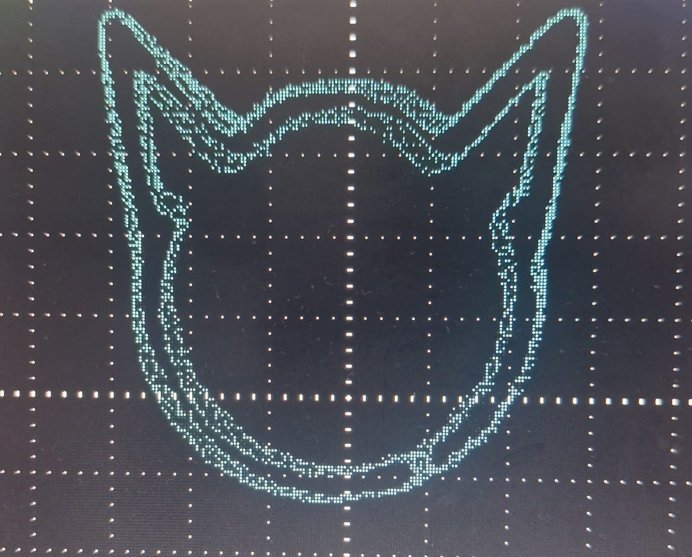
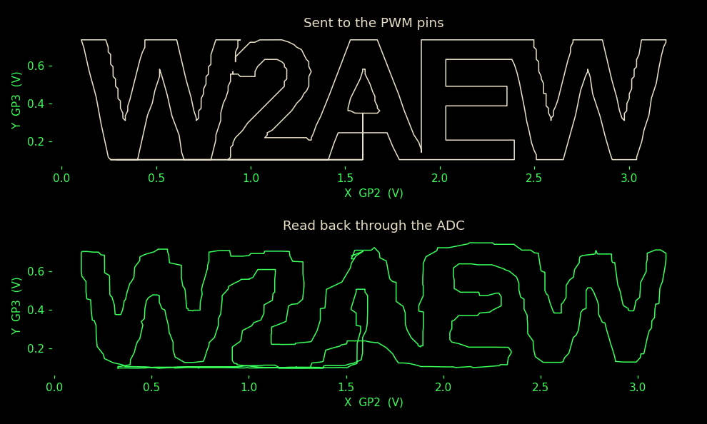
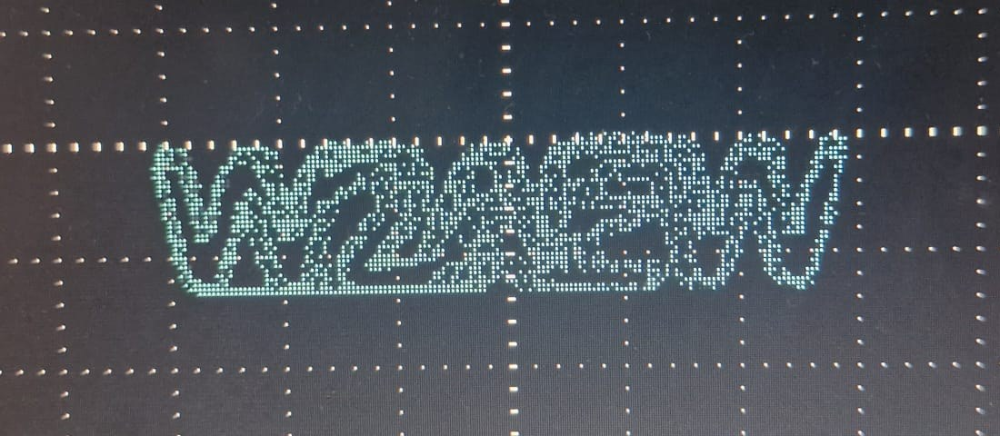

# Drawing vector images on an oscilloscope

## 1. Introduction

In this project I learned how to use an oscilloscope, how to build an RC circuit,
and how to imitate a DAC, a digital to analog converter, using a PWM output
together with that RC circuit.

### 1.1 Aim of the project

I started this project to learn three things: how to put an RC circuit together
and predict beforehand what it will do, how to set up and read an oscilloscope,
and how pulse width modulation turns a pin that can only be on or off into an
adjustable voltage. A picture on the screen was chosen as the target because it
fails visibly. If the filter is wrong the drawing smears, if the point rate is
wrong it flickers, and if the path is wrong the shape is wrong, so all three
subjects have to be right at once before anything on the screen looks like a cat.

The aim is to produce a meaningful vector image in XY mode on an oscilloscope,
from a list of points generated by the board itself. In XY mode the dot on the
screen is positioned by two input voltages rather than by an internal time sweep.
A Raspberry Pi Pico 2 produces those two voltages and moves the dot along a path
fast enough that the eye sees a complete picture.

One property of the instrument decides the design. XY mode has no frame buffer.
A computer monitor stores a grid of pixels and refreshes all of them; an
oscilloscope stores nothing. It shows one dot, and where that dot sits depends
only on the two voltages present at this instant. A picture is therefore a single
ordered list of points that the dot visits in sequence.

The Pico 2 has no analog output, so it cannot produce these two voltages
directly. Both axes are generated by filtering a PWM signal through an RC
network.

### 1.2 Using an oscilloscope

An oscilloscope draws a graph of voltage. In its normal mode the horizontal axis
is time and the vertical axis is the voltage at the probe tip, so the screen
shows the shape of a signal as it changes. The controls that set that mapping
are:

- Volts per division sets the vertical scale, so a taller trace means a larger
  voltage.
- Time per division sets how fast the sweep crosses the screen.
- Input impedance, 1 Mohm here, is the resistance the probe presents to the
  circuit under test. A high value keeps the instrument from loading the circuit
  it is measuring.
- The trigger decides when a sweep starts, which is what makes a repeating
  waveform stand still on screen instead of sliding.

### 1.3 Why an RC filter is used

A GPIO pin on the Pico is a digital output. It can hold 0 V or 3.3 V and nothing
between the two, while the drawing needs a smoothly variable voltage on each
axis. The gap is closed by switching the pin on and off very quickly and
averaging the result. The averaging is done by a resistor and a capacitor, and
the same components also decide how quickly the dot can move, which sets an upper
limit on how many points a picture may contain.

## 2. Theory

### 2.1 How an oscilloscope works

The instrument used in this project is a digital oscilloscope. Its screen is an
LCD, and there is no electron beam, no deflection plate and no phosphor. Each
input channel has its own analog to digital converter. The converter digitises
the voltage at the probe tip at the instrument's sample rate, and the samples are
written into acquisition memory. Everything that appears on screen is
reconstructed from those stored numbers.

In normal operation the instrument plots each sample against its position in the
record: the horizontal axis is time and the vertical axis is the measured
voltage.

XY mode changes that mapping. Time is no longer an axis. The instrument takes the
two samples belonging to the same instant, one from channel 1 and one from
channel 2, and treats them as the horizontal and vertical coordinate of a single
point. Every sample pair becomes one dot on the screen. Feeding the instrument a
list of coordinates fast enough produces a drawing. The time window the
instrument captures has to cover at least one complete pass of the drawing,
otherwise only part of the figure appears. The instrument's own sample rate also
has to be high enough relative to the rate at which points are sent, or
consecutive points are not resolved from one another.

### 2.2 Pulse width modulation

Pulse width modulation, or PWM, is a way of carrying an analog value on a digital
output. The pin produces a square wave of fixed period T. Within each period it
stays high for a time t_on and low for the rest. The ratio

    D = (t_on / T)

is called the duty cycle and runs from 0 to 1. The signal itself is still only
ever 0 V or 3.3 V, but its average over one period is

    V_avg = (D * V_supply)

so a duty cycle of 0.5 averages to 1.65 V and a duty cycle of 0.25 averages to
0.825 V. Changing the duty cycle changes the average, and that average is the
value a following filter will extract.

Two numbers describe a PWM channel. The resolution is how finely the duty cycle
can be set, expressed in bits; this project writes 16 bit duty values, which
divides the range into 65536 steps. The carrier frequency is 1 / T, and it must
sit far above the frequency of the signal being represented so that the filter
can separate the two. The leftover switching that the filter fails to remove
appears on the output as ripple.

### 2.3 Digital to analog conversion

A digital to analog converter, or DAC, turns a number held in a register into a
proportional voltage. It is the inverse of the ADC that a microcontroller uses to
read a voltage. A DAC is described by its resolution, the number of bits and
therefore the number of distinct output levels it can produce; its sample rate,
how many new values per second it accepts; and its settling time, how long the
output takes to arrive at a new value once it has been written.

Dedicated DAC hardware produces an output level for each input code directly. A
PWM pin followed by a low pass filter does the same job with two passive
components and is called a PWM DAC. The pin switches between two levels, the
filter extracts the average, and the duty cycle written to the pin sets that
average. Its cost is that resolution, ripple and settling speed are traded
against one another through the filter and the carrier frequency.

### 2.4 The RC low pass circuit

The filter used on each axis is a resistor in series with the signal and a
capacitor from the output node to ground, with the output taken across the
capacitor. This is a first order low pass filter, the simplest circuit that
passes slow changes and suppresses fast ones.

Its behaviour is set by a single quantity, the time constant

    tau = (R * C)

If the input steps from 0 to a new level, the output does not follow instantly.
It approaches the new level along an exponential curve

    v(t) = V_final * (1 - exp(-t / tau))

which reaches 63.2 % of the step after one tau, 86.5 % after two, and 95.0 %
after three. In the frequency domain the same circuit has a cutoff frequency

    f_c = 1 / (2 * pi * R * C)

defined as the point where the output power has fallen to half of the input, that
is by 3 dB. Above the cutoff the response falls at 20 dB per decade.

Both descriptions matter here, and they pull in opposite directions. Seen as a
frequency filter, the circuit must have a cutoff well below the PWM carrier so
that the switching is smoothed into a clean average, and a large tau does that
better. Seen as a step response, the same circuit must let the output travel from
one point of the drawing to the next within the time allotted to a point, and a
large tau does that worse. Choosing R and C is choosing a position between a
smooth output and a fast one.

This project uses R = 2.2 kohm and C = 4.7 nF on both axes, which give

    tau = (2200 ohm * 4.7 nF) = 10.34 us
    f_c = 1 / (2 * pi * 2200 * 4.7e-9) = 15.4 kHz

At the 32000 points per second used by the main firmware each point lasts
31.25 us, which is 3.02 tau, so the output settles to 95.1 % of each new
coordinate before the next one arrives.

### 2.5 Direct memory access

Direct memory access, or DMA, is hardware that moves data between memory and a
peripheral without the processor executing an instruction for each transfer.

Without it, sending a stream of values to a peripheral is the processor's job. It
loads a value from memory into a register, writes that register to the
peripheral, advances to the next value, and repeats. One pass through that
sequence is needed per value, so the rate at which values reach the peripheral is
set by how fast the program runs.

A DMA controller is instead given a source address, a destination address and a
number of items, and then performs the transfers itself. The processor is free
while this happens. Two properties of that arrangement matter here. The transfer
rate is governed by the peripheral, which requests the next item when it is ready
to accept one, so the timing no longer depends on the speed of the program.
Second, a controller can be set to return to the start of the buffer when it
reaches the end, which replays the same block of memory indefinitely without
anything further being written to it.

## 3. Circuit


**Figure 1.** The analog part of the project.

Figure 1 is the whole analog part of the project. There are two channels, one per
axis, and they are identical and independent of each other.

Each channel is built from three elements. A pulse source, V1 for the X axis and
V2 for the Y axis, stands in for the microcontroller pin; on the board these are
GP2 and GP3 emitting the PWM square wave described in section 2.2. In series with
that source is a 2.2 kohm resistor. From the far side of the resistor a 4.7 nF
capacitor runs down to ground. Two connectors are taken from the node between
the resistor and the capacitor: J1 and J2 on the X channel, J3 and J4 on the Y
channel. The first of each pair goes to the oscilloscope, the second to the ADC
tap through which the Pico reads its own output back on GP26 and GP27.

That node is the one point in the circuit that has to be got right. Connecting
either the probe or the ADC tap on the GPIO side of the resistor instead would
bypass the capacitor and put the raw square wave on the screen.

The two channels share a single ground, brought out on J5 and J6, which is also
where the scope ground clips go.

## 4. Method

### 4.1 Signal path

The chain that turns a list of coordinates into a picture has five stages, with a
sixth branch used only for measurement:

```
coordinate list -> 16 bit duty values -> DMA -> PWM (GP2, GP3) -> RC filter -> scope
                                                                     |
                                                                     +-> ADC (GP26, GP27) -> USB -> Mac viewer
```

The picture on the screen is produced entirely by the board. The branch to the
Mac is one way and exists only for measurement; once the board has been
programmed it keeps drawing without a computer attached.

Everything left of the DMA stage happens once, at startup. The drawing is built
in floating point with coordinates running from -1 to 1 on both axes, then
converted into the integer range the PWM hardware wants. The conversion in
`livescope_fw.py` is

    duty = int((((v + 1.0) * 0.5) * 65535))

applied to each coordinate, which maps -1 to a duty of 0 and +1 to a duty of
65535. The two axes are then interleaved into a single `array.array("H")` buffer
holding one X value followed by one Y value per point.

That interleaved layout is the memory layout a stereo audio buffer already has,
which is what makes the next stage possible.

### 4.2 Driving the output with DMA

The first working version wrote duty values from an ordinary Python loop to two
`pwmio.PWMOut` objects. It worked, but the CPU could only get through the 231
point path 20 to 40 times per second, and the picture visibly shook. Fifty passes
per second is taken as the working threshold for a steady picture.

The fix is to take the CPU out of the drawing loop entirely, using the DMA
described in section 2.5. CircuitPython exposes no direct DMA interface. It does
expose audio output, which is DMA driven, stereo, and fed from a buffer of 16 bit
samples, so the audio path is used as a DMA engine rather than for sound:

```python
sample = audiocore.RawSample(frame, channel_count=2, sample_rate=SAMPLE_RATE)
audio = audiopwmio.PWMAudioOut(left_channel=board.GP2, right_channel=board.GP3)
audio.play(sample, loop=True)
```

The left channel carries X and the right channel carries Y. `RawSample` wraps the
interleaved buffer from section 4.1, and `sample_rate` sets how many points per
second the dot visits. `loop=True` replays the buffer forever without further
instructions, so once `play()` returns, the drawing continues with no CPU
involvement.

This is why the drawing only firmware ends with an empty `while True: pass` loop.
The loop does no work; it only stops `code.py` from reaching its end, because
CircuitPython switches the outputs off when the program exits. From that point on
the CPU is idle.

The files whose names end in `_livescope_fw.py` end in a loop that does do work,
reading the ADC taps and writing bursts to USB. That loop is the measurement
branch of section 4.1 and not part of drawing. The picture would be identical
without it, which is the point: the CPU is busy with something unrelated to the
drawing while the drawing continues.

## 5. Results


**Figure 2.** Output of the arc built cat on an Owon SmartDS5032E in XY mode. Both
channels at 1 V per division, the instrument acquiring at 125 kS/s with its time
base at 4.0 ms per division.

Figure 2 is what the circuit produces. The path closes on itself, the strokes are
continuous, and the connecting lines between the head, the eyes and the nose are
visible as part of the drawing, which is the consequence of having no way to
turn the dot off.


**Figure 3.** The same running board with the time base at 4 s per division,
which drops the acquisition rate to 125 S/s. Vertical scale is 500 mV per
division here, so the figure covers more of the screen.

Figure 3 shows the same board doing the same thing, changed only by the
instrument's own settings. The board still sends 32000 points per second while
the instrument records 125 pairs per second, so it keeps roughly one pair in
every (32000 / 125) = 256 and the ones it keeps come from many different passes
rather than from a single run along the path. The outline breaks into
unconnected dots. This is the second condition stated in section 2.1, and it is a
property of the measurement rather than of the drawing.

Figures 2 and 3 are the 32 kHz arc built cat, the firmware Table 1 describes. The
same instrument photographs the two 512 kHz drawings in Figures 4 and 5, where
the point rate is sixteen times higher and the dotted trace of Figure 3 returns
for the same reason. All four photographs are the same circuit; only the firmware
and the instrument settings change.

Voltages were measured by the Pico reading its own outputs through GP26 and GP27.
Values marked derived are computed from the measured ones rather than observed
directly.

Table 1 does not describe the run photographed in Figure 2. Measuring requires
the ADC branch, so the numbers come from `livescope_fw.py`, which draws the same
cat built from arcs and leaves the path at its natural 231 points, redrawing at
138.5 Hz. The run in Figure 2 was an earlier variant that resampled that same
outline to 400 evenly spaced points and therefore redrew at (32000 / 400) =
80 Hz; that variant is no longer kept in the repository, since the geometry it
drew is the geometry `livescope_fw.py` already carries. The circuit, the sample
rate and the voltages are the same either way.

**Table 1.** Measured, derived and configured values for `livescope_fw.py`.

| Quantity | Value | Source |
| --- | --- | --- |
| RC time constant, `(R * C)` | 10.34 us | derived |
| RC cutoff frequency | 15.4 kHz | derived |
| Sample rate | 32000 points/s | set |
| Time per point | 31.25 us = 3.02 tau | derived |
| Settling per point | 95.1 % | derived |
| Path length | 231 points | from the path builder |
| Frame rate | 138.5 Hz | derived |
| X output, mean / min / max | 1.696 / 0.426 / 2.850 V | measured |
| Y output, mean / min / max | 1.725 / 0.562 / 3.226 V | measured |

The frame rate is listed as derived because it is not read off an instrument. It
follows from the two rows above it, as (32000 / 231) = 138.5 Hz, and holds
because the DMA visits every point in the buffer at the configured rate whatever
the CPU is doing. The 20 to 40 Hz of the Python loop in section 4.2 was measured,
because there the rate depended on how fast the code ran and could not be
predicted from the buffer alone. That contrast is the result: the same path on
the same hardware, made steady by moving it off the CPU.

### 5.1 Why the outputs do not reach 0 and 3.3 V

The two voltage rows of Table 1 invite an obvious question. The PWM DAC can
produce anything from 0 to 3.3 V, and section 4.1 maps a coordinate of -1 to a
duty of 0 and +1 to 65535, yet X only spans 0.426 to 2.850 V and Y only 0.562 to
3.226 V. Nothing is being lost. The cat simply does not fill the coordinate box
it is drawn in.

The path can be measured directly. Its corners run from -0.720 to 0.720 on the X
axis and from -0.620 to 0.950 on Y, and putting those through the same mapping
gives the voltages the circuit ought to produce:

**Table 2.** Voltages predicted from the path geometry, against Table 1.

| Quantity | From the path | Measured | Difference |
| --- | --- | --- | --- |
| X mean | 1.690 V | 1.696 V | 6 mV |
| X min / max | 0.462 / 2.838 V | 0.426 / 2.850 V | 36 / 12 mV |
| Y mean | 1.719 V | 1.725 V | 6 mV |
| Y min / max | 0.627 / 3.217 V | 0.562 / 3.226 V | 65 / 9 mV |

The means agree to 6 mV on both axes, which is about 0.2 % of the 3.3 V range,
and no part of the calculation was fitted to the measurement. The output
therefore covers exactly the range the drawing asks for.

The extremes agree less well, and the reason is what they are rather than a fault
in the circuit. A mean averages 3000 samples, while a minimum or a maximum is one
single sample. Means are therefore the reliable numbers here; minimum and maximum
are affected far more by ADC noise, and move by tens of millivolts from run to
run, while the means return within 2 mV on a repeat.

## 6. Predicting and measuring the outline drawing

### 6.1 What the second drawing asks of the filter

The cat outline in `cat_outline.py` is a closed path of 368 corners. Corner
points alone would not do, because the dot spends the same time on every point
it is given, so a long stroke drawn from two corners gets the same drawing time
as a short one and comes out dimmer. `even_spaced_path` therefore measures the
perimeter, 1687.2 units on the 0 to 255 grid the corners are listed on, and
places 7200 points along it at equal spacing, which is one point every 0.2343
units, or 3.03 mV once the grid is mapped onto 0 to 3.3 V.

This firmware runs the buffer at 512000 points per second, so

    time per point = (1 / 512000) = 1.953 us
    frame rate = (512000 / 7200) = 71.1 Hz

The first number is the one that matters, because it is smaller than the time
constant of section 2.4 rather than larger. One point now lasts

    (1.953 us / 10.34 us) = 0.189 tau

where the main firmware of section 4 allowed 3.02 tau per point. The filter has
no chance to settle on any individual coordinate. This is not a fault to be
fixed. The step from one point to the next is only 3.03 mV, and a filter that
cannot follow a step that small in the time available is simply averaging over
its neighbours.

That gives a prediction rather than a worry. The output should be the intended
outline smoothed over roughly the last tau of travel, which is

    (10.34 us / 1.953 us) = 5.3 points = 1.24 units = 16.1 mV

so the drawn dot should sit about 16 mV off the intended line wherever the line
bends, stay on it where the line is straight, and pull the sharpest features,
the ear tips, inward. Both axes should end up spanning slightly less than they
were told to.

### 6.2 What came back

The readback path of section 4.1 supplies the measurement. `livescope.py` reads
the burst the board sends over USB, finds one complete lap of the drawing in that
data, and passes it through a 7 sample median filter before display, so the trace
plotted here is exactly what the live viewer shows. One lap turned out to be 630
ADC sample pairs, which at 71.1 laps per second is 44800 pairs per second.

 

**Figure 4.** The 7200 point outline as it was sent to GP2 and GP3, the same
outline read back through GP26 and GP27, and the instrument showing it in XY
mode. The two plotted panels are in volts on the same axes, so the difference
between them is the difference between the two signals and not an effect of
scaling. The photograph is the same firmware seen by the instrument instead of
by the ADC; its trace is broken into dots for the reason given in Figure 3,
because 512000 points per second is far above the rate the instrument acquires
at.

**Table 3.** Predicted and measured values for the outline firmware.

| Quantity | Value | Source |
| --- | --- | --- |
| Corners in the outline | 368 | set |
| Points drawn per lap | 7200 | set |
| Perimeter | 1687.2 units | derived |
| Spacing between points | 0.2343 units = 3.03 mV | derived |
| Sample rate | 512000 points/s | set |
| Time per point | 1.953 us = 0.189 tau | derived |
| Frame rate | 71.1 Hz | derived |
| Smoothing predicted from tau | 16.1 mV | derived |
| Off-path distance, mean | 15.0 mV | measured |
| Off-path distance, median | 12.8 mV | measured |
| Off-path distance, worst | 59.5 mV | measured |
| X span, intended and measured | 3.041 V, 2.995 V | measured |
| Y span, intended and measured | 3.092 V, 3.033 V | measured |
| ADC pairs per lap | 630 | measured |
| ADC rate in this firmware | 44800 pairs/s | derived |

The mean distance from a measured point to the nearest point of the intended
outline is 15.0 mV, against the 16.1 mV predicted from the time constant alone.
The prediction was made from R, C and the sample rate, with nothing fitted to the
capture, so the filter is behaving as section 2.4 says it should and the error
visible on screen is the error the component values buy. How much weight the
closeness of the two numbers can carry is a separate question, and section 6.3
answers it: the readback carries an error of its own, of comparable size, so this
agreement establishes the right order of magnitude rather than a match to three
figures.

The size of that number also rules out the other candidate. The Pico 2 has a 12
bit ADC, so over the 3.3 V range one step is

    (3.3 V / 4096) = 0.806 mV

The measured deviation is about 19 of those steps, far too large to be the
converter counting coarsely and small enough to match the filter.

The spans shrink as expected. X was told to cover 3.041 V and covers 2.995 V, a
loss of 46 mV or 1.5 %; Y was told to cover 3.092 V and covers 3.033 V, a loss of
59 mV or 1.9 %. Blunted corners are the reason, and Figure 4 shows it directly:
the ear tips in the readback are rounder than the ones that were sent, because an
average over the last 5.3 points cannot reach a corner that the path leaves again
immediately.

The worst single deviation, 59.5 mV, does sit at the tip of the left ear, but the
rest of the large deviations are scattered rather than collected at the corners.
The mean is therefore the figure that tests the model of section 2.4; the worst
case mixes filter lag with whatever ADC noise survived the 7 sample median, and
should not be read as a measurement of the filter alone.

One feature of Figure 4 belongs to the measurement rather than to the circuit.
The right hand panel is visibly built from straight steps, although the board
draws 7200 points per lap. The ADC captures 630 pairs in the time the board draws
7200 points, so it keeps roughly one point in every

    (7200 / 630) = 11.4

and the viewer joins those with straight lines. What is plotted is a 630 sided
polygon of a 7200 point path. This is the same undersampling that produced Figure
3, met here in the readback path instead of on the oscilloscope. It also explains
where the steps are visible: a straight run of the outline is reproduced exactly
by a chord across it, so the staircase only shows up on the curves, along the
cheeks and around the ears.

### 6.3 The oscilloscope and the ADC readback compared

The board's output is looked at twice in this report, by two instruments that tap
the same node and disagree about what they can see. Figure 4 now shows both for
the same firmware: the photograph is the oscilloscope screen, the right hand
panel is the ADC readback drawn by `livescope.py`. Neither is a check on the
other, and it is worth being clear about why.

Table 4 quantifies that using the two runs whose instrument settings were
recorded: the oscilloscope column is the 32 kHz run photographed in Figure 2, and
the readback column is the 512 kHz run of Figure 4. The two columns therefore
describe different drawings at different point rates, which is why the sampling
density row differs so sharply. The comparison is between the two observers, not
between the two drawings.

**Table 4.** The two ways the output is observed.

| | Oscilloscope, Figure 2 | ADC readback, Figure 4 |
| --- | --- | --- |
| Rate | 125 kS/s | 44800 pairs/s |
| Against a drawing at | 32000 points/s | 512000 points/s |
| Sampling density | 3.9 samples per point | 1 pair per 11.4 points |
| X and Y | same instant | read one after the other |
| Output | a photograph | numbers |

The first thing the table settles is why the two figures look so different. The
oscilloscope takes about four samples for every point the board draws, so the
figure on screen is denser than the drawing itself and appears continuous. The
ADC keeps one pair in every 11.4 points, so the readback is sparser than the
drawing and shows as a polygon. That is a difference in the observers, not in the
board.

The second row is the one that limits the measurement. Section 2.1 describes the
instrument taking the two samples belonging to the same instant, one per channel,
which is what makes a sample pair a point. The readback firmware cannot do that.
The X and Y values are not read at exactly the same time, so a small time
difference appears in the measurement. That gap is bounded by the pair period,

    (1 / 44800) = 22.3 us

and the drawing does not stand still during it. At 512000 points per second the
dot covers up to 11.4 points in that time, which is 2.68 units of path, or
34.7 mV.

That figure deserves attention because of what it sits next to. Section 6.2
measured the readback as 15.0 mV from the intended outline and matched it against
16.1 mV predicted from the time constant. The agreement is close, but the
measurement path carries a second error source of up to 34.7 mV that has nothing
to do with the filter. The two do not simply add, since the time difference
displaces a point along the drawing rather than across it and contributes little
where the path runs along one axis, but the honest reading of section 6.2 is
weaker than it first appears: the filter model predicts the right order of
magnitude, and the measurement is not clean enough to call it a confirmation to
two figures.

Improving this is a firmware question rather than a circuit one. Reading X, then
Y, then X again and averaging the two X readings would centre the pair in time
and remove most of the difference.

### 6.4 The same measurement on a second drawing

Section 6.2 measured one drawing. A single measurement cannot separate what the
circuit does from what that particular cat happens to ask of it, so the same
firmware structure was given a second picture. For this second test a closed path
with a completely different shape was built from the word W2AEW, in
`w2aew_outline.py`. It has 486 corners against the cat's 368, a perimeter of
1666.8 units against 1687.2, and a completely different distribution of
directions: the word is almost all vertical and horizontal runs, while the cat is
almost all curves.

What the two share is everything the filter cares about. Both play 7200 points at
512000 points per second, so both give each point 1.953 us, or 0.189 tau, and
both redraw at 71.1 Hz. The spacing between points comes out at
(1666.8 / 7200) = 0.2315 units for the word against 0.2343 for the cat, which is
3.00 mV against 3.03 mV. Running the prediction of section 6.1 unchanged, the
filter should smooth over the last

    (10.34 us / 1.953 us) = 5.3 points = 1.227 units = 15.9 mV

against the 16.1 mV predicted for the cat. If the numbers of section 6.2 describe
the circuit, the word should measure the same. If they describe the cat, it
should not.

 

**Figure 5.** The word as it was sent to GP2 and GP3, the same word read back
through GP26 and GP27, and the instrument showing it at 500 mV/div on both
channels. The bridge along the baseline and the climb into the A are visible in
all three.

**Table 5.** The two drawings measured the same way. Each row is one lap of a
fresh capture, taken with `outline_compare.py` and the streaming firmware for
that drawing.

| Quantity | W2AEW | Cat outline | Source |
| --- | --- | --- | --- |
| Corners in the table | 486 | 368 | set |
| Perimeter | 1666.8 units | 1687.2 units | derived |
| Spacing between points | 0.2315 units = 3.00 mV | 0.2343 units = 3.03 mV | derived |
| Smoothing predicted from tau | 15.9 mV | 16.1 mV | derived |
| Off-path distance, mean | 14.3 mV | 14.3 mV | measured |
| Off-path distance, median | 11.2 mV | 12.6 mV | measured |
| Off-path distance, worst | 57.6 mV | 55.9 mV | measured |
| ADC pairs per lap | 632 | 629 | measured |
| X span, intended and measured | 3.092 V, 3.008 V | 3.041 V, 2.996 V | measured |
| Y span, intended and measured | 0.634 V, 0.647 V | 3.092 V, 3.028 V | measured |

The cat column is a fresh capture, not the one section 6.2 reports, which is
why its lap comes out at 629 pairs against the 630 recorded there: the lap is
found in a burst that starts at an arbitrary point, so its length moves by a
sample or two between runs.

The two means agree at 14.3 mV. Since the drawings differ in shape, corner count
and the direction their strokes run, while agreeing in point spacing and time per
point, the distance measured in section 6.2 belongs to the signal path and not to
the cat. The cat row here is also a repeat of section 6.2 on a later capture:
14.3 mV against the 15.0 mV recorded there, a 5 % spread between two runs of the
same firmware, which is the honest precision of this measurement.

One row behaves differently and is worth naming. Every X span shrinks, by 84 mV
for the word and 45 mV for the cat, which is the filter pulling the extremes in
as section 6.1 said it would. The Y span of the word does the opposite and comes
out 13 mV wider than intended. That drawing is only 0.634 V tall, so its Y
extremes are set by a handful of samples at the top and bottom of a short span,
and ADC noise of a few millivolts widens the pair of extremes instead of pulling
them together. The effect is real but it is a property of measuring a short span
with single samples, not of the filter.

## 7. Conclusion

The project set out to draw a picture in XY mode from points the board generates
itself, and it does. Two PWM pins and two RC filters stand in for a DAC the Pico
2 does not have, a DMA engine borrowed from the audio peripheral replays the
point buffer without the processor, and the drawing holds still on the screen.

The part worth keeping is what the same filter does at two different speeds. R
and C were never changed, so tau stayed at 10.34 us throughout, but the time
given to one point was changed by a factor of sixteen, and that turns one circuit
into two different instruments:

**Table 6.** The same filter used two ways.

| | Section 5, 32 kHz | Section 6, 512 kHz |
| --- | --- | --- |
| Time per point | 31.25 us | 1.953 us |
| In time constants | 3.02 tau | 0.189 tau |
| Settling within one point | 95.1 % | 17.2 % |
| Points per drawing | 231 | 7200 |
| Frame rate | 138.5 Hz | 71.1 Hz |
| How it works | each point is reached | neighbours are averaged |

The left column is the textbook arrangement: give the filter three time constants
and it arrives at each coordinate before the next one is written. The right
column breaks that rule and works anyway, because 7200 points along a 1687 unit
perimeter sit 3.03 mV apart, and a filter that cannot follow a 3 mV step in the
time available is not failing, it is averaging. Section 6 measured the cost of
that averaging as 15.0 mV, the same order as the 16.1 mV predicted from tau
alone, and the visible price is a pair of blunted ear tips.

Two conditions turned out to matter more than any component value. The drawing
must be one closed, ordered path, because there is no frame buffer and no way to
turn the dot off. And the instrument has to sample fast enough to resolve the
points it is sent, which is a property of the oscilloscope rather than of the
circuit; Figure 3 shows the same board producing a cloud of dots when that
condition is dropped.

I started this project to learn how to use an oscilloscope, how PWM works, how to
build and understand an RC circuit, and how to draw vector images on an
oscilloscope. By the end of the project, I had learned these topics to a level
that was sufficient to understand and complete this project successfully.
